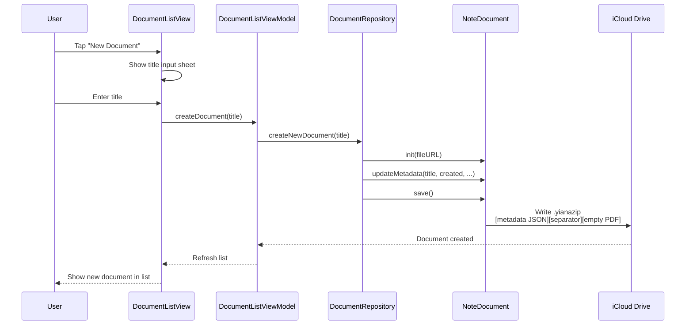
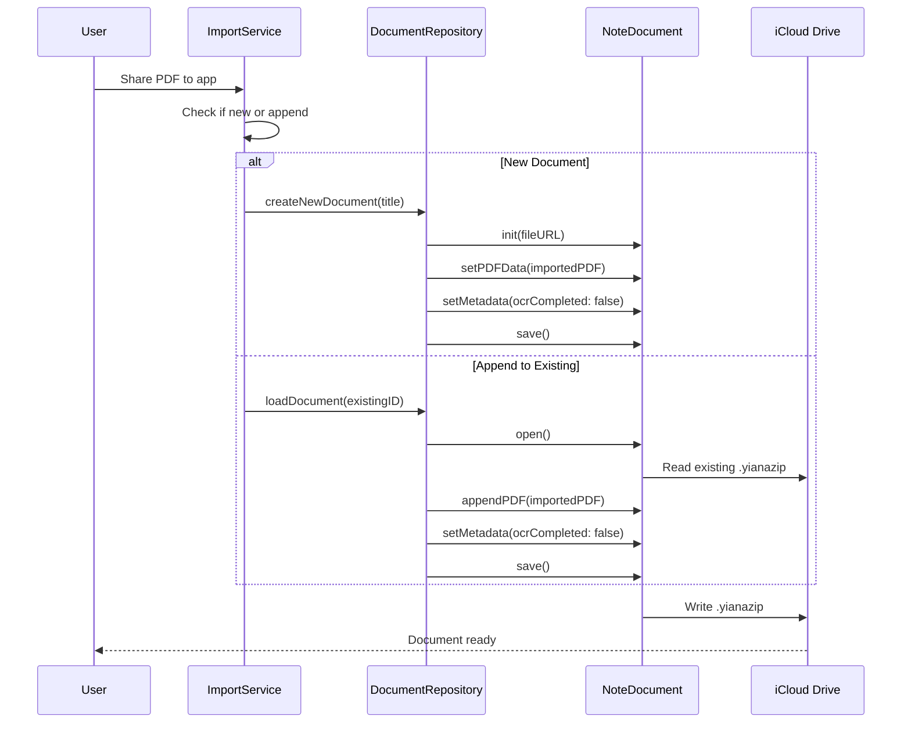
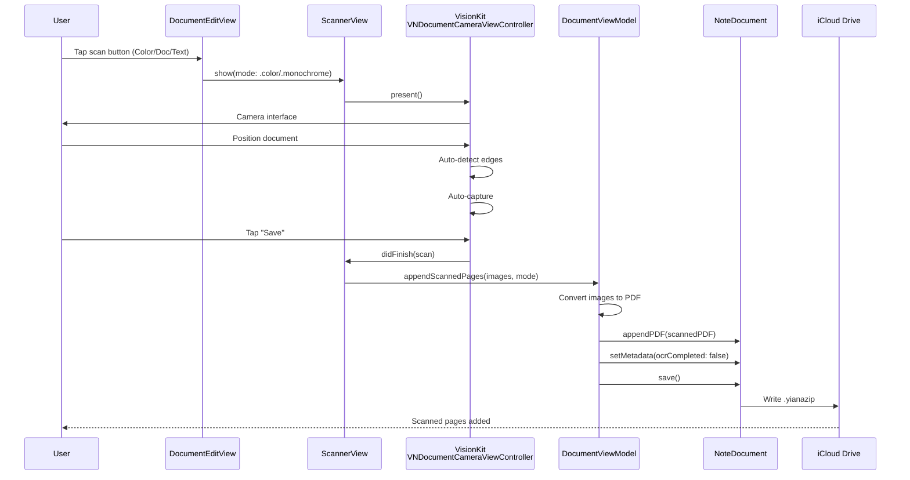
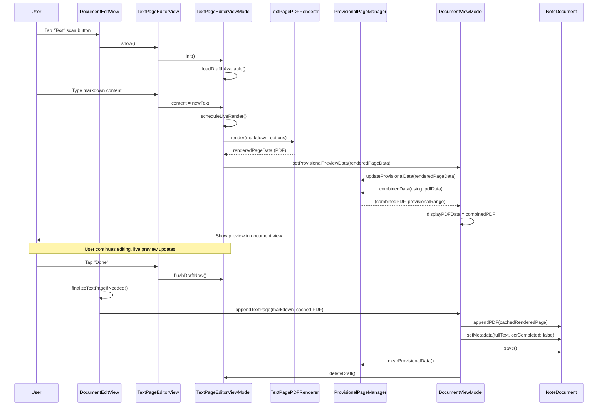
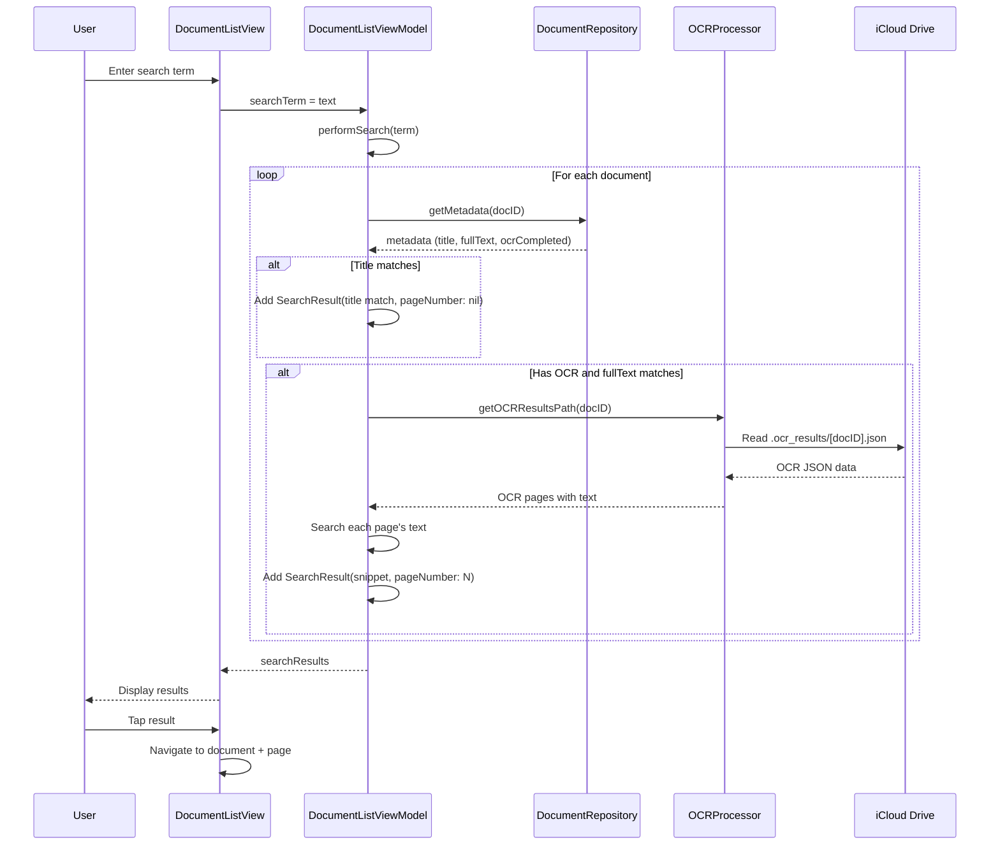
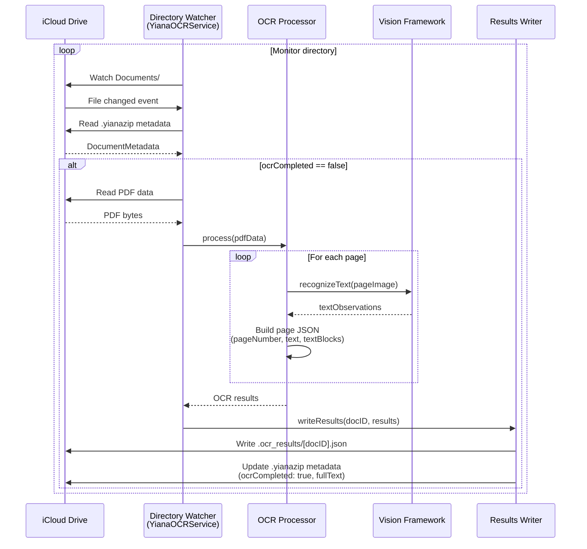
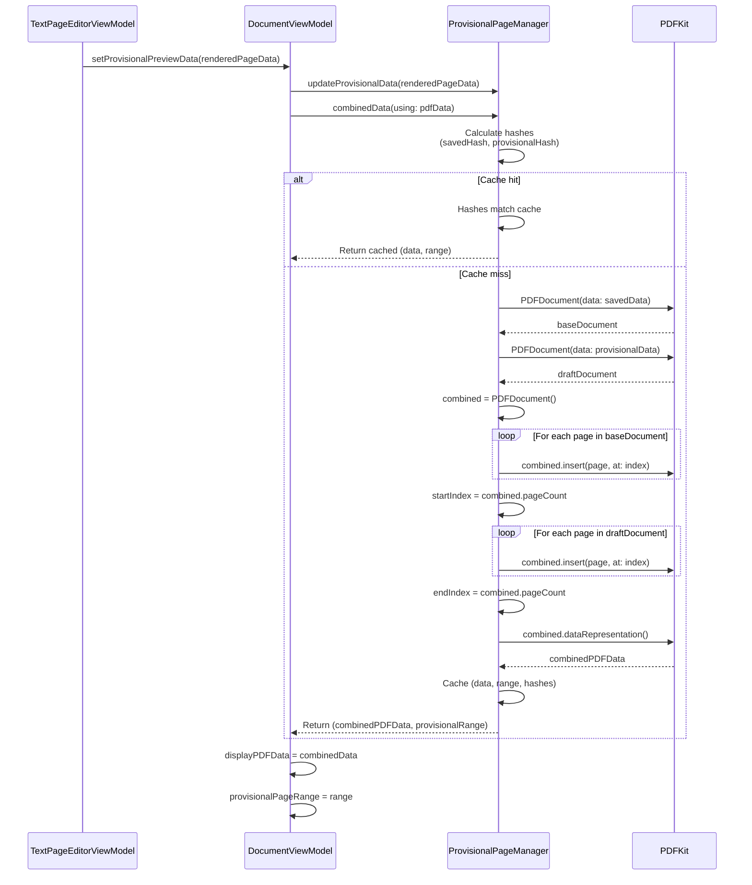

# Data Flow Diagrams

This document contains data flow diagrams for major operations in Yiana.

## Document Creation & Import Flow



## PDF Import Flow



## Scanning Flow



## Text Page Creation Flow



## Search Flow



## OCR Processing Flow (Backend Service)



## Provisional Page Composition Flow



## Key Data Structures

### DocumentMetadata
```swift
struct DocumentMetadata: Codable {
    let id: UUID
    var title: String
    var created: Date
    var modified: Date
    var pageCount: Int
    var ocrCompleted: Bool
    var fullText: String?
}
```

### .yianazip Format
```
[metadata JSON bytes]
[0xFF 0xFF 0xFF 0xFF]  // 4-byte separator
[raw PDF bytes]
```

### OCR Results JSON
```json
{
  "pages": [
    {
      "pageNumber": 1,  // 1-based
      "text": "Full page text...",
      "textBlocks": [
        {
          "text": "Block text",
          "bounds": {"x": 0, "y": 0, "width": 100, "height": 20}
        }
      ]
    }
  ]
}
```
