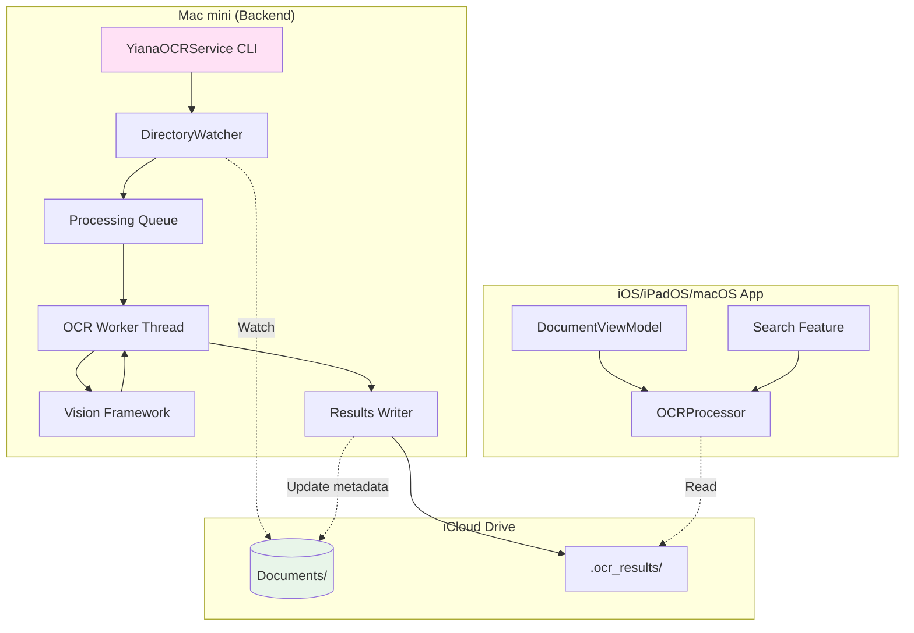
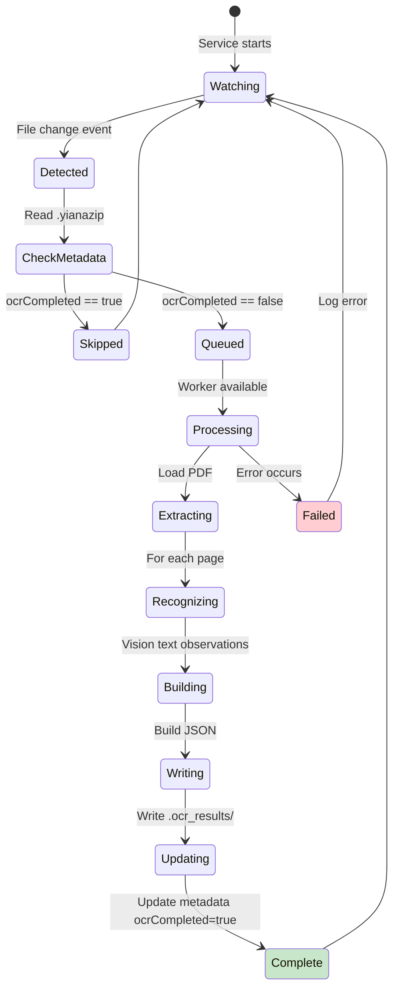
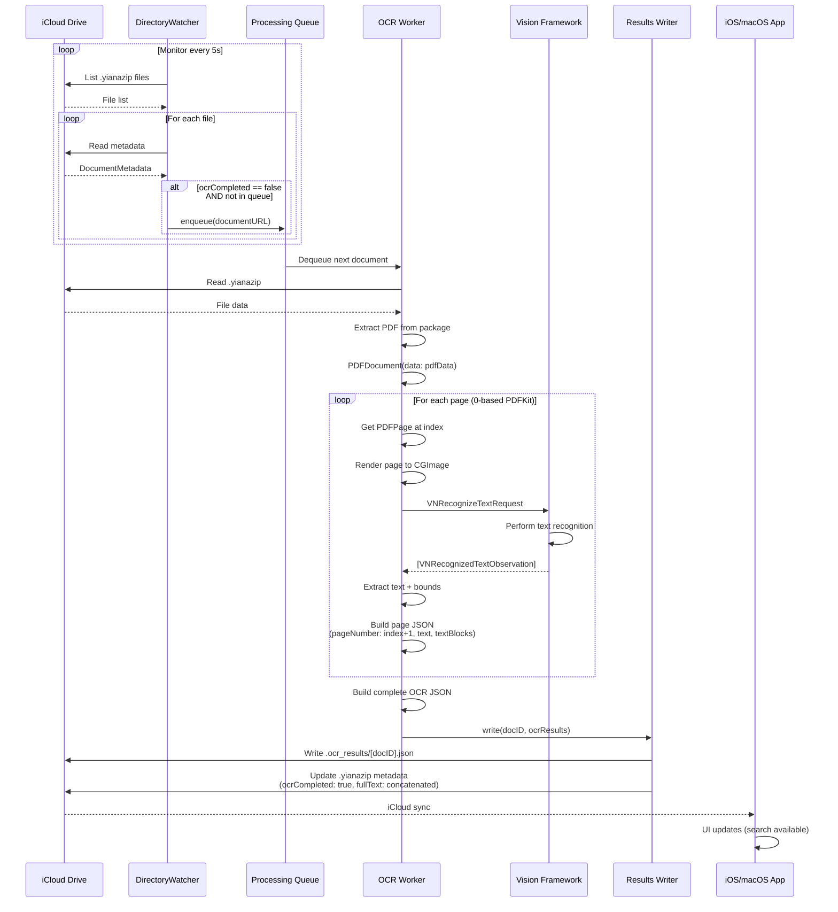
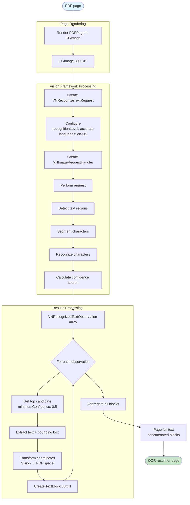
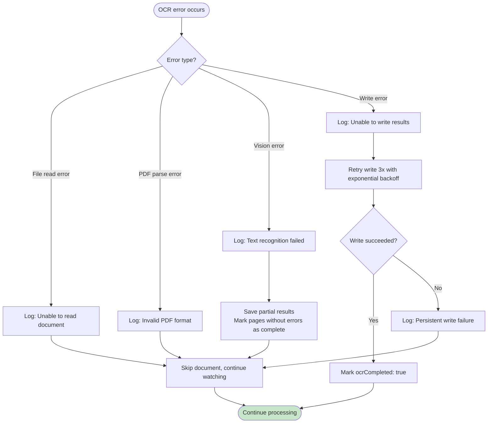

# OCR Processing Flow

This document describes the OCR processing pipeline, including the backend service architecture and integration with the main app.

## OCR Service Architecture



## OCR Processing State Machine



## Detailed OCR Processing Flow



## Vision Framework Text Recognition Detail



## OCR Results JSON Structure

```json
{
  "documentId": "UUID",
  "processedDate": "2025-10-08T12:34:56Z",
  "pages": [
    {
      "pageNumber": 1,
      "text": "Full page text concatenated from all blocks...",
      "textBlocks": [
        {
          "text": "Individual text block",
          "bounds": {
            "x": 72.0,
            "y": 100.0,
            "width": 450.0,
            "height": 24.0
          },
          "confidence": 0.95
        }
      ]
    }
  ]
}
```

## App-Side OCR Integration

```mermaid
flowchart TB
    Start([User searches])
    Start --> Check

    Check{OCR completed?}
    Check -->|No| NoResults[Return title-only results]
    Check -->|Yes| Load

    Load[OCRProcessor.getOCRResultsPath]
    Load --> Read

    Read[Read .ocr_results/[docID].json]
    Read --> Parse

    subgraph "JSON Parsing"
        Parse[Decode OCR JSON]
        Parse --> Pages[Extract pages array]
        Pages --> Search[Search each page.text]
    end

    Search --> Matches{Found matches?}
    Matches -->|Yes| BuildResults

    subgraph "Result Building"
        BuildResults[For each match]
        BuildResults --> Snippet[Extract text snippet around match]
        Snippet --> PageNum[Get pageNumber 1-based]
        PageNum --> Result[Create SearchResult]
    end

    Result --> Display[Return results to UI]
    Matches -->|No| NoResults

    NoResults --> Display
    Display --> End([Show results])

    style Start fill:#e1f5ff
    style End fill:#c8e6c9
```

## OCR Service CLI Commands

```bash
# Start OCR service (watches iCloud Drive)
yiana-ocr watch

# Process single document
yiana-ocr process /path/to/document.yianazip

# Reprocess all documents (ignores ocrCompleted flag)
yiana-ocr reprocess --all

# Process documents in directory
yiana-ocr batch /path/to/documents/

# Check service status
yiana-ocr status

# Configuration
yiana-ocr config --recognition-level accurate
yiana-ocr config --languages en-US,en-GB
yiana-ocr config --watch-interval 5
```

## Performance Characteristics

| Operation | Latency | Notes |
|-----------|---------|-------|
| **Directory Watching** |
| File system scan | 100-500ms | Every 5s default |
| Metadata read | 10-50ms | Per document |
| Queue check | <1ms | In-memory |
| **OCR Processing** |
| Page render to image | 50-200ms | 300 DPI |
| Vision text recognition | 200ms-2s | Per page, depends on complexity |
| JSON serialization | 10-50ms | Per document |
| Results write | 20-100ms | JSON file + metadata update |
| **Typical Documents** |
| 1-page document | 1-3s | Total processing time |
| 10-page document | 5-20s | Total processing time |
| 50-page document | 30-90s | Total processing time |

## Error Handling



## iCloud Sync Coordination

The OCR service must coordinate with iCloud sync to avoid conflicts:

1. **Read coordination**: Wait for download to complete before processing
2. **Write coordination**: Use NSFileCoordinator for atomic updates
3. **Conflict resolution**: Last-write-wins (service updates take precedence)
4. **Sync triggers**: Atomic writes to .yianazip ensure iCloud detects changes

## Implementation Files

- **OCR Service**: `YianaOCRService/Sources/YianaOCR/`
  - `main.swift` - CLI entry point
  - `DirectoryWatcher.swift` - File system monitoring
  - `OCRProcessor.swift` - Vision framework integration
  - `ResultsWriter.swift` - JSON serialization + metadata updates

- **App Integration**: `Yiana/Services/OCRProcessor.swift`
  - Reads .ocr_results/ JSON files
  - Provides search interface
  - Exposes OCR status to UI

## Future Enhancements

- **Incremental OCR**: Process only new pages when appending to existing document
- **Priority queue**: User-initiated OCR gets higher priority than background batch
- **Multi-language**: Support for non-English documents
- **Format options**: Export to hOCR, ALTO XML for compatibility
- **Quality metrics**: Track confidence scores, provide UI indicators for low-confidence text
