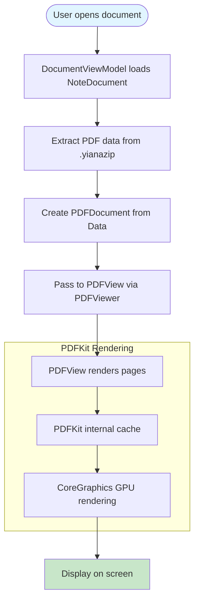
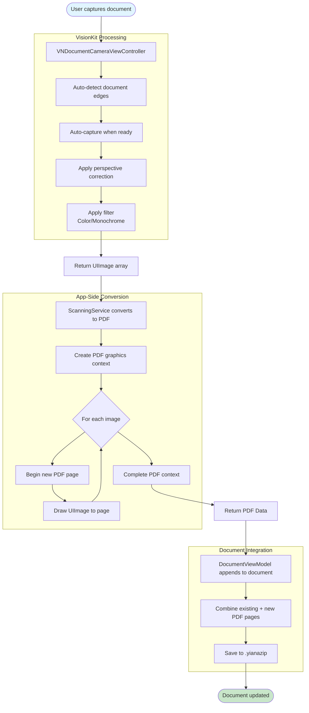
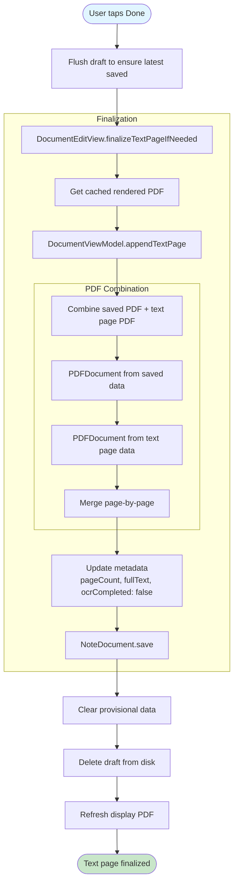
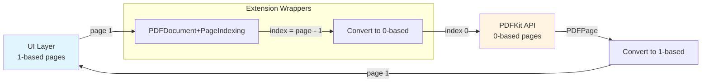

# PDF Rendering Pipeline

This document describes the PDF rendering pipeline used throughout Yiana, including viewing, scanning, and text page creation.

## PDF Viewing Pipeline (Read-Only)

## Scanned Document to PDF Pipeline

## Text Page Markdown to PDF Pipeline

```mermaid
flowchart TB
    Start([User types markdown])
    Start --> Schedule

    Schedule[TextPageEditorViewModel<br/>schedules render]
    Schedule --> Debounce[Debounce timer<br/>default 0.5s]
    Debounce --> Render

    subgraph "TextPagePDFRenderer Processing"
        Render[render markdown, options]
        Render --> Parse[Parse markdown to tokens]

        Parse --> Build[Build NSAttributedString]

        subgraph "Markdown Parsing"
            Build --> Headers[Parse headers H1/H2/H3]
            Headers --> Bold[Parse bold **text**]
            Bold --> Italic[Parse italic *text*]
            Italic --> Lists[Parse lists - item, 1. item]
            Lists --> Quotes[Parse blockquotes > text]
            Quotes --> Rules[Parse horizontal rules ---]
        end

        Rules --> Layout[Calculate layout with paper size]

        subgraph "PDF Generation"
            Layout --> Context[Create UIGraphicsPDFRenderer]
            Context --> BeginPage[Begin PDF page]
            BeginPage --> DrawHeader[Draw header<br/>timestamp, page number]
            DrawHeader --> DrawBody[Draw attributed text body]
            DrawBody --> CheckOverflow{Text overflows page?}

            CheckOverflow -->|Yes| BeginPage
            CheckOverflow -->|No| EndPage[End page]
        end

        EndPage --> PDFData[Return PDF Data]
    end

    PDFData --> Cache[Cache in viewModel.latestRenderedPageData]
    Cache --> Provisional

    subgraph "Provisional Page Composition"
        Provisional[Pass to ProvisionalPageManager]
        Provisional --> HashCheck{Cache valid?}

        HashCheck -->|Yes| UseCached[Use cached combined PDF]
        HashCheck -->|No| BuildNew

        subgraph "Build Combined PDF"
            BuildNew[Create new PDFDocument]
            BuildNew --> CopySaved[Copy saved pages]
            CopySaved --> AppendDraft[Append draft page s]
            AppendDraft --> Range[Track provisional range]
            Range --> DataRep[Get dataRepresentation ]
        end

        DataRep --> UpdateCache[Update cache with new data + hashes]
        UpdateCache --> UseCached
    end

    UseCached --> Display[DocumentViewModel.displayPDFData]
    Display --> PDFView[PDFView renders combined PDF]
    PDFView --> End([User sees live preview])

    style Start fill:#e1f5ff
    style End fill:#c8e6c9
```

## PDF Finalization Pipeline (Text Pages)

## PDF Page Indexing (1-based Convention)

## Performance Characteristics

| Operation | Latency | Notes |
|-----------|---------|-------|
| **PDF Viewing** |
| Load PDF from .yianazip | 10-50ms | Depends on file size |
| PDFKit page render | 16-50ms | Cached after first render |
| Page navigation | <16ms | PDFKit cache |
| **Scanning** |
| VisionKit capture | Instant | Automatic detection |
| Image to PDF conversion | 50-200ms | Per image, depends on resolution |
| Append to document | 20-100ms | Depends on existing page count |
| **Text Pages** |
| Markdown parse + render | 50-200ms | Depends on content length |
| Provisional composition (cache hit) | <1ms | Hash-based cache |
| Provisional composition (cache miss) | 20-50ms | Typical documents |
| Provisional composition (large docs) | 50-120ms | 50+ pages |
| Text page finalization | 20-100ms | Append + metadata update |

## Memory Characteristics

| Component | Memory Usage |
|-----------|--------------|
| PDF page cache (PDFKit) | ~500KB-2MB per page |
| Provisional page data | <1MB (single text page) |
| Combined PDF cache | 2x saved PDF size (temporary) |
| Scanned image buffer | ~5-10MB per image (temporary) |

## Implementation Files

- **PDF Viewing**: `Yiana/Views/PDFViewer.swift`, `Yiana/Extensions/PDFDocument+PageIndexing.swift`
- **Scanning**: `Yiana/Views/ScannerView.swift`, `Yiana/Services/ScanningService.swift`
- **Text Pages**: `Yiana/Services/TextPagePDFRenderer.swift`, `Yiana/ViewModels/TextPageEditorViewModel.swift`
- **Provisional Composition**: `Yiana/Services/ProvisionalPageManager.swift`
- **Document Integration**: `Yiana/ViewModels/DocumentViewModel.swift`, `Yiana/Models/NoteDocument.swift`
