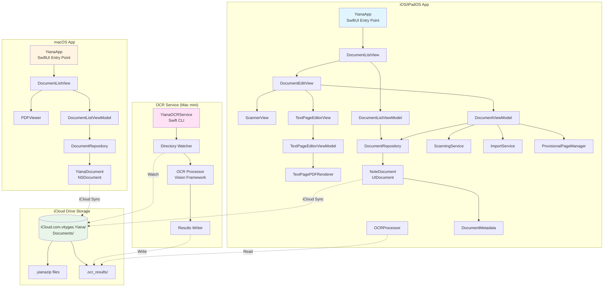

# System Architecture Diagram

This diagram shows the overall system architecture of Yiana, including app components, services, and storage.

## Component Responsibilities

### iOS/iPadOS App
- **Views**: SwiftUI UI layer (DocumentListView, DocumentEditView, ScannerView, TextPageEditorView)
- **ViewModels**: State management and business logic (DocumentListViewModel, DocumentViewModel, TextPageEditorViewModel)
- **Services**: Core functionality (DocumentRepository, ScanningService, ImportService, OCRProcessor, TextPagePDFRenderer, ProvisionalPageManager)
- **Models**: Data structures (NoteDocument extends UIDocument, DocumentMetadata)

### macOS App
- **Views**: SwiftUI UI layer (DocumentListView, PDFViewer)
- **ViewModels**: State management (DocumentListViewModel)
- **Services**: Core functionality (DocumentRepository)
- **Models**: Data structures (YianaDocument extends NSDocument)

### iCloud Drive Storage
- **Documents**: `.yianazip` package files with embedded metadata + PDF
- **OCR Results**: `.ocr_results/` directory with JSON/XML/hOCR files

### OCR Service
- **Directory Watcher**: Monitors iCloud Drive for new/modified documents
- **OCR Processor**: Extracts text using Vision framework
- **Results Writer**: Saves OCR results to `.ocr_results/` directory

## Data Flow Patterns

1. **Document Creation**: YianaApp → DocumentRepository → NoteDocument/YianaDocument → iCloud Drive
2. **Scanning**: ScannerView → ScanningService → DocumentRepository → iCloud Sync
3. **OCR Processing**: iCloud Sync → OCR Service → Vision Framework → .ocr_results/ → iCloud Sync → OCRProcessor reads results
4. **Text Page Creation**: TextPageEditorView → TextPagePDFRenderer → ProvisionalPageManager → DocumentViewModel → DocumentRepository
5. **Search**: DocumentListViewModel → OCRProcessor (reads .ocr_results/) → Search results

## Platform Differences

- iOS/iPadOS uses UIDocument (NoteDocument)
- macOS uses NSDocument (YianaDocument)
- Both share DocumentMetadata format
- Both sync via iCloud Drive
- No shared protocols or cross-platform abstractions (platform-specific is preferred)
