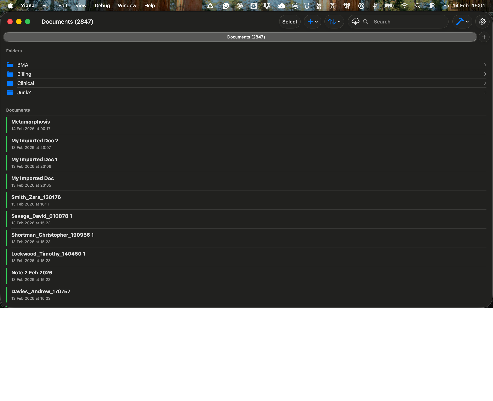
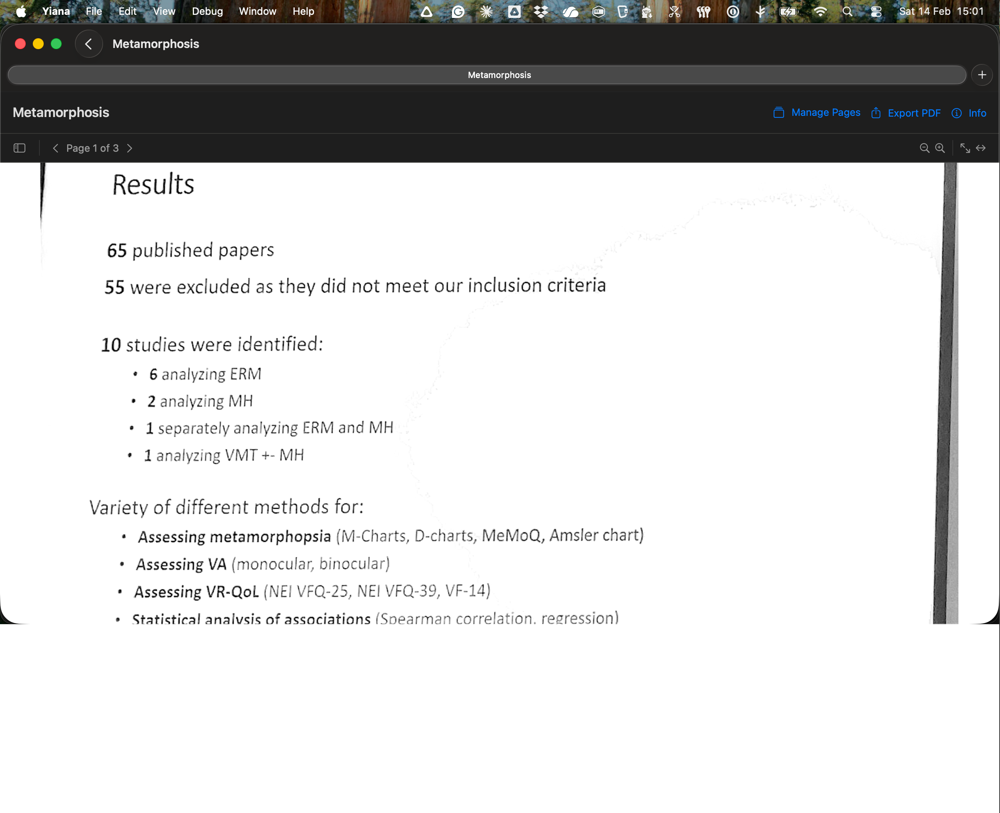
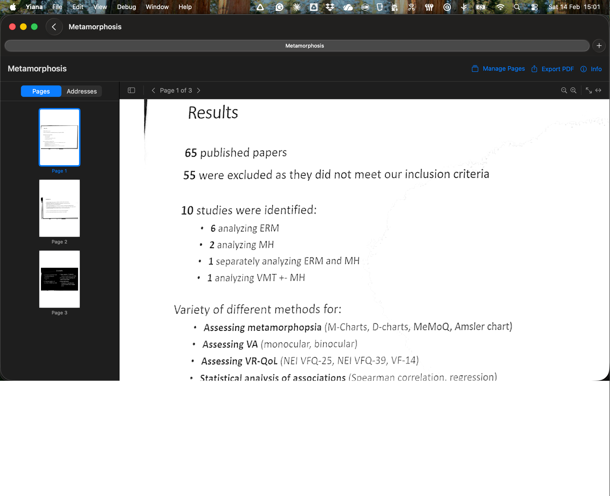
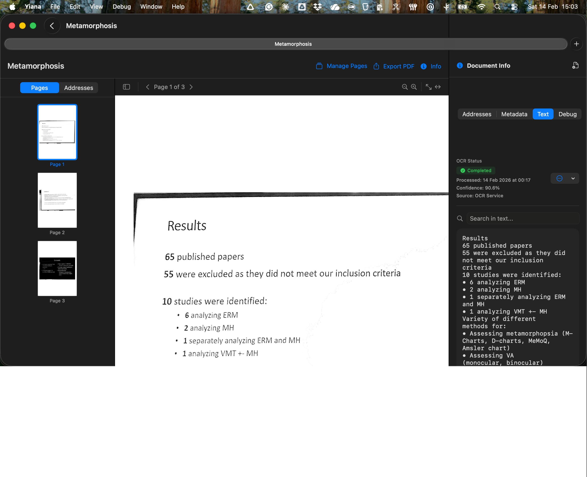
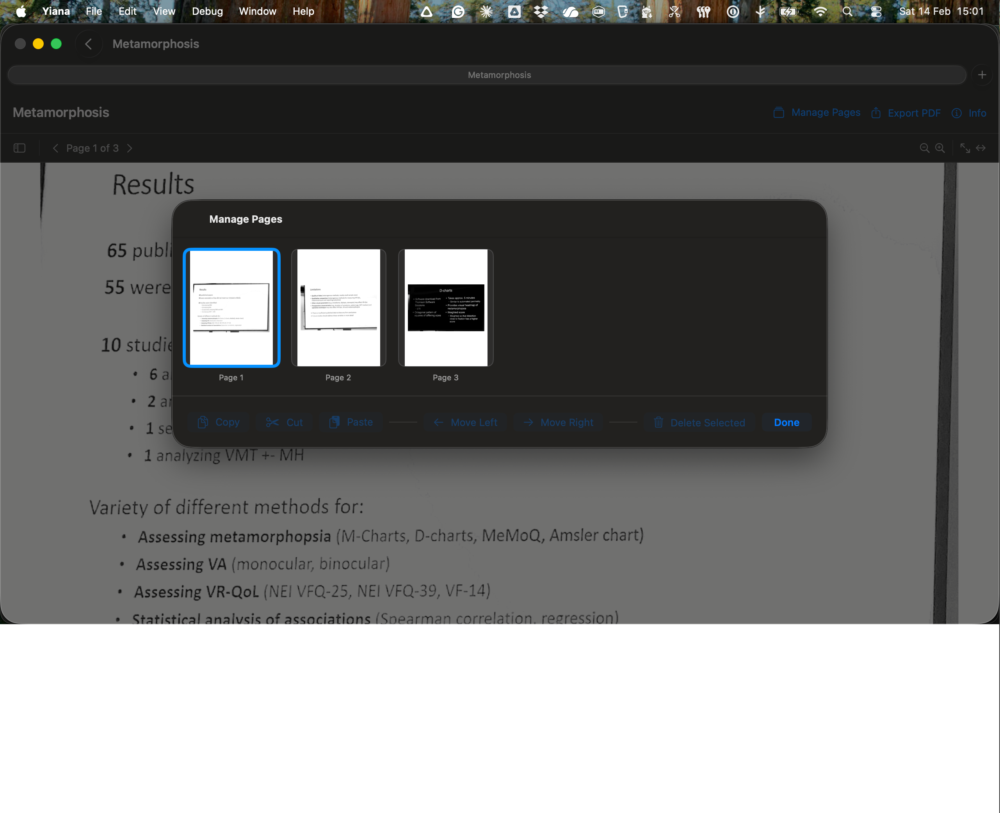

# Yiana macOS UI Component Map

> **Date:** 14 February 2026
> **Scope:** macOS reading and organising interface only (edit view and iOS excluded)
> **Purpose:** Unambiguous label system for discussing UI changes

Every visible element has a unique label (e.g. **A4**, **B3a**). Use these labels when
discussing changes so there is no ambiguity about which element is being referenced.

---

## Screen A: Document List View



```
┌─────────────────────────────────────────────────────────────────┐
│ [A1] WINDOW TITLE BAR                                          │
│  "Documents (2847)"                                             │
│  Left: (none)        Right: [A2] Select  [A3] Add Menu (+v)    │
│                              [A4] Sort Menu (↕v)                │
│                              [A5] iCloud Sync Indicator (⟳)     │
│                              [A6] Search Field                  │
│                              [A7] Dev Mode Toggle (⟋)           │
│                              [A8] Settings Gear                 │
├─────────────────────────────────────────────────────────────────┤
│ [A9] NAVIGATION PATH BAR   "Documents (2847)"          [A10]+  │
├─────────────────────────────────────────────────────────────────┤
│                                                                 │
│ [A11] FOLDERS SECTION HEADER  "Folders"                         │
│  ┌─────────────────────────────────────────────────────────┐    │
│  │ 📁 BMA                                              >  │    │
│  │ 📁 Billing                                          >  │    │
│  │ 📁 Clinical                                         >  │    │
│  │ 📁 Junk?                                            >  │    │
│  └─────────────────────────────────────────────────────────┘    │
│  [A12] FOLDER ROW  (icon + name + chevron)                      │
│                                                                 │
│ [A13] DOCUMENTS SECTION HEADER  "Documents"                     │
│  ┌─────────────────────────────────────────────────────────┐    │
│  │ ▌Metamorphosis                                         │    │
│  │ ▌14 Feb 2026 at 00:17                                  │    │
│  │─────────────────────────────────────────────────────────│    │
│  │ ▌My Imported Doc 2                                     │    │
│  │ ▌13 Feb 2026 at 23:07                                  │    │
│  │─────────────────────────────────────────────────────────│    │
│  │ ▌...                                                   │    │
│  └─────────────────────────────────────────────────────────┘    │
│  [A14] DOCUMENT ROW  (status bar + title + date)                │
│    [A14a] Status Color Bar (left edge tint)                     │
│    [A14b] Document Title                                        │
│    [A14c] Date Subtitle                                         │
│                                                                 │
│ (scrolls to more documents...)                                  │
│                                                                 │
│ [A15] VERSION SECTION (at bottom of list, not visible here)     │
│                                                                 │
└─────────────────────────────────────────────────────────────────┘
```

### Context menus

- **A12 (folder row):** rename, delete
- **A14 (document row):** rename, move to folder, duplicate, delete

---

## Screen B: Document Read View (no sidebars)



```
┌─────────────────────────────────────────────────────────────────┐
│ [B1] WINDOW TITLE BAR                                          │
│  Left: [B1a] Back Button (<)   "Metamorphosis"                 │
├─────────────────────────────────────────────────────────────────┤
│ [B2] NAVIGATION PATH BAR   "Metamorphosis"              [B2a]+ │
├─────────────────────────────────────────────────────────────────┤
│ [B3] ACTION TOOLBAR                                             │
│  Left: "Metamorphosis" (document title, read-only label)        │
│  Right: [B3a] Manage Pages (📁 icon + text)                    │
│         [B3b] Export PDF (↗ icon + text)                       │
│         [B3c] Info Toggle (ⓘ icon + text)                      │
├─────────────────────────────────────────────────────────────────┤
│ [B4] PDF TOOLBAR                                                │
│  Left:  [B4a] Sidebar Toggle (▯ icon)                          │
│         [B4b] Page Navigator  < Page 1 of 3 >                  │
│  Right: [B4c] Zoom In (+🔍)                                    │
│         [B4d] Zoom Out (-🔍)                                   │
│         [B4e] Fit Page (⤢)                                     │
│         [B4f] Fit Width (↔)                                    │
├─────────────────────────────────────────────────────────────────┤
│                                                                 │
│                                                                 │
│                   [B5] PDF CONTENT AREA                         │
│                   (MacPDFViewer / PDFKit NSView)                │
│                                                                 │
│                                                                 │
│                                                                 │
├─────────────────────────────────────────────────────────────────┤
│                   [B6] DEAD SPACE                               │
│                   (empty area below PDF when page               │
│                    doesn't fill the window)                     │
│                                                                 │
└─────────────────────────────────────────────────────────────────┘
```

---

## Screen C: Document Read View (left sidebar open)



```
┌──────────────────────────────────────────────────────────────────┐
│ [B1] WINDOW TITLE BAR                                            │
├──────────────────────────────────────────────────────────────────┤
│ [B2] NAVIGATION PATH BAR                                         │
├──────────────────────────────────────────────────────────────────┤
│ [B3] ACTION TOOLBAR                                               │
├────────────┬─────────────────────────────────────────────────────┤
│ [C1] LEFT  │ [B4] PDF TOOLBAR                                    │
│ SIDEBAR    │                                                      │
│            │                                                      │
│ [C1a]      │                                                      │
│ SIDEBAR    │                                                      │
│ MODE PICKER│                                                      │
│ ┌────┬────┐│                                                      │
│ │Pgs │Addr││                                                      │
│ └────┴────┘│                                                      │
│            ├──────────────────────────────────────────────────────┤
│ [C1b]      │                                                      │
│ THUMBNAIL  │                                                      │
│ SCROLL AREA│              [B5] PDF CONTENT AREA                   │
│            │                                                      │
│ ┌────────┐ │                                                      │
│ │ thumb  │ │                                                      │
│ │ Page 1 │ │                                                      │
│ └────────┘ │                                                      │
│ [C1c]      │                                                      │
│ THUMBNAIL  │                                                      │
│ CELL       │                                                      │
│  (selected │                                                      │
│  = blue    │                                                      │
│  border)   │                                                      │
│ ┌────────┐ │                                                      │
│ │ Page 2 │ │                                                      │
│ └────────┘ │                                                      │
│ ┌────────┐ │                                                      │
│ │ Page 3 │ │                                                      │
│ └────────┘ │                                                      │
│            │                                                      │
└────────────┴──────────────────────────────────────────────────────┘
```

### Left sidebar modes (C1a picker)

| Mode | Content shown |
|------|--------------|
| **Pages** | Thumbnail grid of all pages (C1b/C1c) |
| **Addresses** | Extracted address cards for the document |

---

## Screen D: Document Read View (both sidebars open)



```
┌──────────────────────────────────────────────────────────────────────┐
│ [B1] WINDOW TITLE BAR                                                │
├──────────────────────────────────────────────────────────────────────┤
│ [B2] NAVIGATION PATH BAR                                             │
├──────────────────────────────────────────────────────────────────────┤
│ [B3] ACTION TOOLBAR                                                   │
├────────────┬──────────────────────────────┬──────────────────────────┤
│ [C1] LEFT  │ [B4] PDF TOOLBAR             │ [D1] RIGHT SIDEBAR       │
│ SIDEBAR    │                              │ HEADER                   │
│            │                              │  ⓘ "Document Info" [D1a]✕│
│ Pages|Addr │                              ├──────────────────────────┤
│            │                              │ [D2] INFO TAB BAR        │
│ ┌────────┐ │                              │ ┌────┬────┬────┬─────┐  │
│ │ Page 1 │ │                              │ │Addr│Meta│Text│Debug│  │
│ └────────┘ │                              │ └────┴────┴────┴─────┘  │
│ ┌────────┐ │   [B5] PDF CONTENT AREA      ├──────────────────────────┤
│ │ Page 2 │ │                              │ [D3] TAB CONTENT AREA    │
│ └────────┘ │                              │                          │
│ ┌────────┐ │                              │ (when Text tab selected:)│
│ │ Page 3 │ │                              │ [D3a] OCR Status Badge   │
│ └────────┘ │                              │   "● Completed"          │
│            │                              │ [D3b] OCR Metadata       │
│            │                              │   Processed date         │
│            │                              │   Confidence %           │
│            │                              │   Source                 │
│            │                              │ [D3c] Reprocess Button   │
│            │                              │   (emoji dropdown)       │
│            │                              │ [D3d] Search in Text     │
│            │                              │   🔍 "Search in text..." │
│            │                              │ [D3e] OCR Text Content   │
│            │                              │   (scrollable monospace) │
│            │                              │                          │
└────────────┴──────────────────────────────┴──────────────────────────┘
```

### Right sidebar tabs (D2)

| Tab | Label | Content |
|-----|-------|---------|
| **D2a** | Addresses | Extracted patient/GP address cards (editable fields) |
| **D2b** | Metadata | Document metadata: title, dates, tags, folder, OCR status |
| **D2c** | Text | OCR text with status badge, confidence, and search |
| **D2d** | Debug | File size, raw JSON viewer, internal state |

---

## Screen E: Manage Pages Sheet (modal)



```
        ┌──────────────────────────────────────────┐
        │ [E1] SHEET TITLE  "Manage Pages"         │
        │                                          │
        │  ┌──────┐  ┌──────┐  ┌──────┐           │
        │  │      │  │      │  │      │           │
        │  │  P1  │  │  P2  │  │  P3  │           │
        │  │      │  │      │  │      │           │
        │  └──────┘  └──────┘  └──────┘           │
        │  [E2] PAGE THUMBNAIL GRID                │
        │   (tap to select; blue border = selected)│
        │                                          │
        ├──────────────────────────────────────────┤
        │ [E3] PAGE ACTION TOOLBAR                 │
        │  [E3a] Copy                              │
        │  [E3b] Cut                               │
        │  [E3c] Paste                             │
        │  [E3d] Move Left                         │
        │  [E3e] Move Right                        │
        │  [E3f] Delete Selected                   │
        │  [E3g] Done                              │
        └──────────────────────────────────────────┘
```

---

## Quick Reference: All Labels

| Label | Element | Screen |
|-------|---------|--------|
| **A1** | Window title bar (list view) | A |
| **A2** | Select mode button | A |
| **A3** | Add menu (+ dropdown) | A |
| **A4** | Sort menu (dropdown) | A |
| **A5** | iCloud sync indicator | A |
| **A6** | Search field | A |
| **A7** | Dev mode toggle | A |
| **A8** | Settings gear | A |
| **A9** | Navigation path bar | A |
| **A10** | Path bar "+" button | A |
| **A11** | Folders section header | A |
| **A12** | Folder row (icon + name + chevron) | A |
| **A13** | Documents section header | A |
| **A14** | Document row | A |
| **A14a** | — Status color bar (left edge) | A |
| **A14b** | — Document title | A |
| **A14c** | — Date subtitle | A |
| **A15** | Version section (bottom of list) | A |
| **B1** | Window title bar (read view) | B, C, D |
| **B1a** | Back button | B, C, D |
| **B2** | Navigation path bar | B, C, D |
| **B2a** | Path bar "+" button | B, C, D |
| **B3** | Action toolbar | B, C, D |
| **B3a** | Manage Pages button | B, C, D |
| **B3b** | Export PDF button | B, C, D |
| **B3c** | Info toggle button | B, C, D |
| **B4** | PDF toolbar | B, C, D |
| **B4a** | Sidebar toggle | B, C, D |
| **B4b** | Page navigator (< Page N of M >) | B, C, D |
| **B4c** | Zoom in | B, C, D |
| **B4d** | Zoom out | B, C, D |
| **B4e** | Fit page | B, C, D |
| **B4f** | Fit width | B, C, D |
| **B5** | PDF content area (PDFKit) | B, C, D |
| **B6** | Dead space below PDF | B |
| **C1** | Left sidebar (container) | C, D |
| **C1a** | Sidebar mode picker (Pages / Addresses) | C, D |
| **C1b** | Thumbnail scroll area | C, D |
| **C1c** | Thumbnail cell (one per page) | C, D |
| **D1** | Right sidebar header | D |
| **D1a** | Close sidebar button | D |
| **D2** | Info tab bar | D |
| **D2a** | — Addresses tab | D |
| **D2b** | — Metadata tab | D |
| **D2c** | — Text tab | D |
| **D2d** | — Debug tab | D |
| **D3** | Tab content area | D |
| **D3a** | OCR status badge | D (Text tab) |
| **D3b** | OCR metadata (date, confidence, source) | D (Text tab) |
| **D3c** | Reprocess button | D (Text tab) |
| **D3d** | Search in text field | D (Text tab) |
| **D3e** | OCR text content (scrollable) | D (Text tab) |
| **E1** | Manage Pages sheet title | E |
| **E2** | Page thumbnail grid | E |
| **E3** | Page action toolbar | E |
| **E3a** | Copy button | E |
| **E3b** | Cut button | E |
| **E3c** | Paste button | E |
| **E3d** | Move Left button | E |
| **E3e** | Move Right button | E |
| **E3f** | Delete Selected button | E |
| **E3g** | Done button | E |

---

## Navigation Flow

```
Screen A                Screen B/C/D              Screen E
(Document List)  ───>   (Document Read)  ───>     (Manage Pages)
                click        │                    modal sheet
               doc row       │ B3c toggles ──> D (right sidebar)
                             │ B4a toggles ──> C (left sidebar)
                             │ B3a opens   ──> E (manage pages)
```

## Source files (for code reference)

| Screen | Primary source file |
|--------|-------------------|
| A | `Yiana/Views/DocumentListView.swift` |
| B | `Yiana/Views/DocumentReadView.swift` |
| B5 | `Yiana/Views/MacPDFViewer.swift` |
| C1 | `Yiana/Views/ThumbnailSidebarView.swift` (in MacPDFViewer) |
| D | `Yiana/Views/DocumentInfoPanel.swift` |
| E | `Yiana/Views/PageManagementView.swift` |
