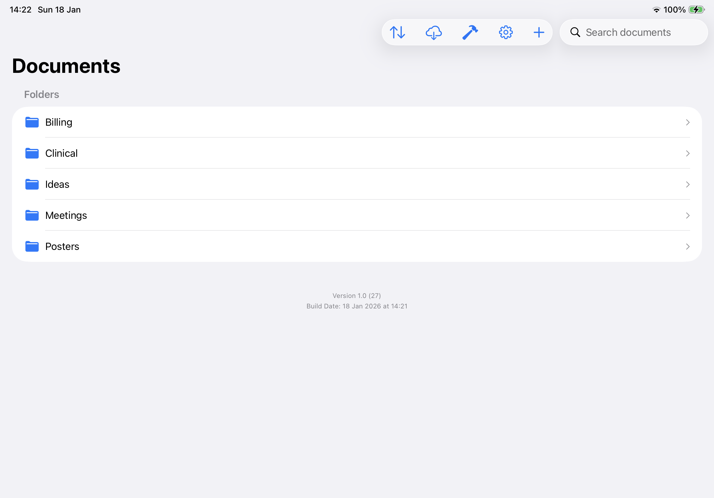
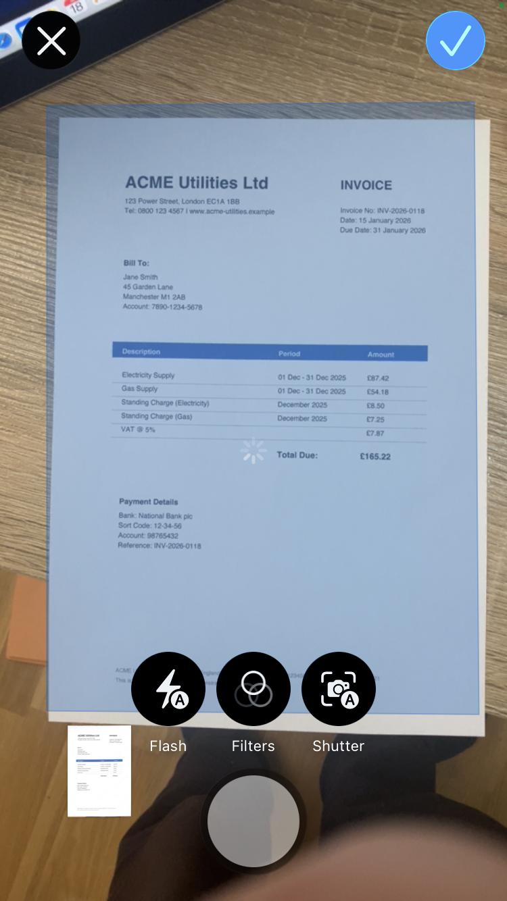
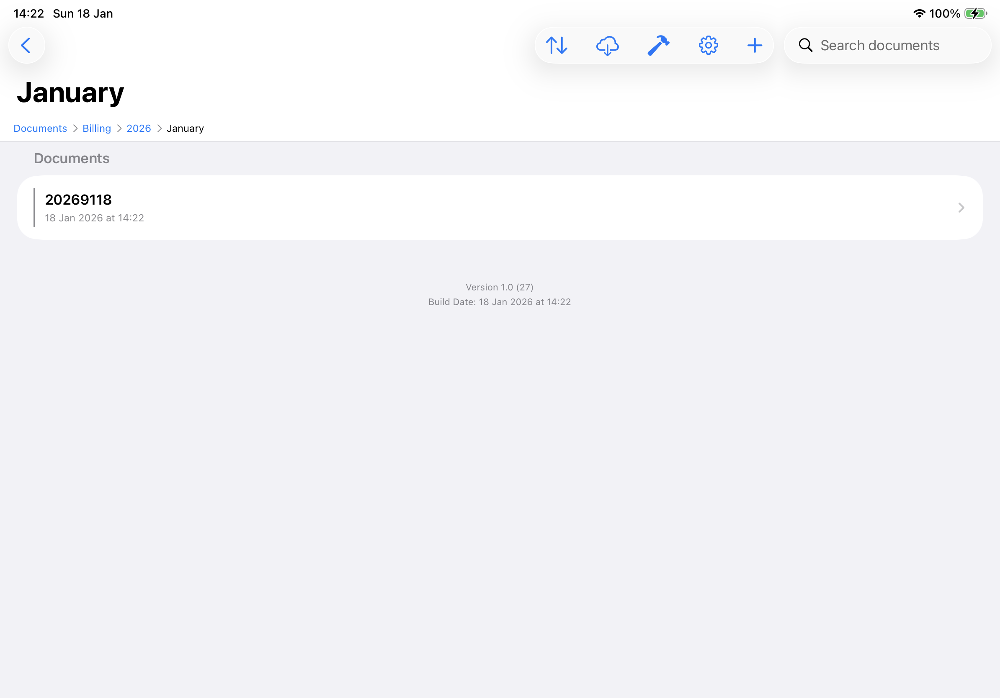

<strong>Beta Release</strong> 
Yiana is currently in beta testing. Some features may not work as expected. Please do not use for mission-critical documents until the full release. We'd love your <a href="/Yiana/support/">feedback</a>.

# Yiana

**Simple, private document scanning for iOS and macOS.**

Yiana helps you scan, organise, and search your documents — all synced securely through your personal iCloud account. [Why we built it →](/Yiana/about/)

  <a href="https://testflight.apple.com/join/YOUR_CODE_HERE" style="display: inline-block; background: #0071e3; color: white; padding: 12px 24px; border-radius: 8px; text-decoration: none; font-weight: 600;">Join the Beta on TestFlight</a>

<!-- Hero screenshot: Show document list on iPad -->

  

## Features

### One-Tap Scanning
Two dedicated buttons for the scans you need:
- **Monochrome** — Perfect for text documents, forms, and receipts. Clean, sharp, smaller files.
- **Colour** — For photos, diagrams, or anything where colour matters.

Yiana automatically detects page edges and enhances quality. No fiddling with settings.

<!-- Screenshot: Scanning view with edge detection -->

  

### Text Notes
Create text documents directly in Yiana. Write notes, draft letters, or compose any text content. When you're done, your note is saved as a PDF — creating a permanent, tamper-evident record just like your scans.

### Add Text to Pages
Need to fill in a form? Add text directly onto any page with precise positioning controls. Nudge text pixel-by-pixel to line up exactly where you need it — perfect for forms, annotations, or adding notes to existing documents.

### Import PDFs
Already have PDF files? Import them directly into Yiana to keep all your documents in one place.

### Organise with Folders
Create folders to organise your documents however you like. Keep work separate from personal, or organise by project, client, or date.

<!-- Screenshot: Folder organisation -->

  

### Search Your Documents
Find any document instantly. Yiana processes your scanned documents so you can search through their text content.

<!-- Screenshot: Search results -->

  

### iCloud Sync
Your documents sync automatically across all your Apple devices. Start a scan on your iPhone, continue on your iPad, review on your Mac.

### Privacy First
Your documents stay yours. Everything is stored in your personal iCloud account — we never see your data.

### No Vendor Lock-In
Your documents are stored as standard ZIP files containing PDFs. Extract them anytime, with or without Yiana. [Learn more →](/Yiana/your-data/)

---

  <a href="https://testflight.apple.com/join/YOUR_CODE_HERE" style="display: inline-block; background: #0071e3; color: white; padding: 12px 24px; border-radius: 8px; text-decoration: none; font-weight: 600;">Join the Beta on TestFlight</a>

  

